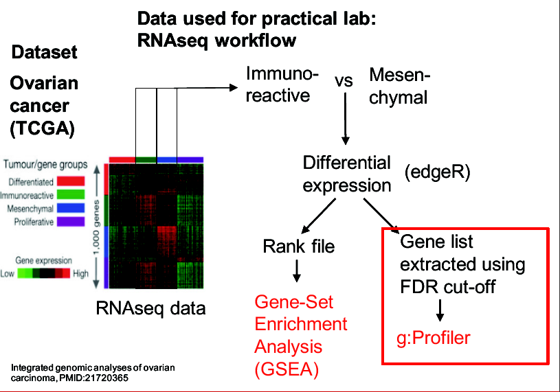
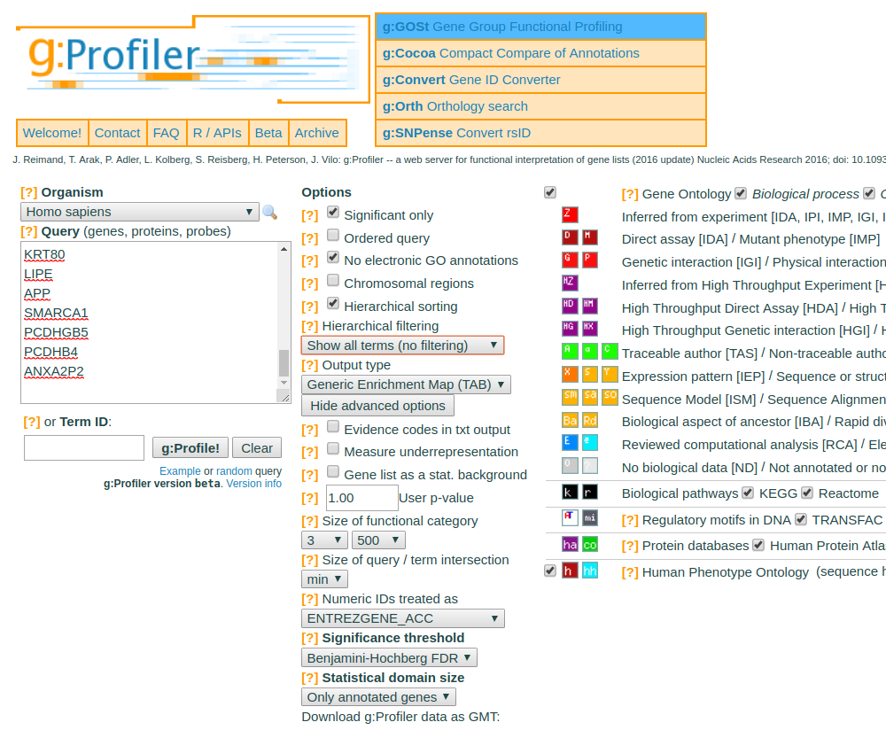

```{r global_options, include=FALSE}
knitr::opts_chunk$set(fig.width=12, fig.height=8, cache=FALSE, 
                      echo=TRUE, warning=FALSE, message=FALSE, results ='markup')
options(warn=-1, width=100)
```

```{r installation, echo=FALSE, message=FALSE}
installifnot <- function (packageName){
 if (!(require(packageName, character.only=TRUE))) {
    install.packages(packageName)
  }else{
    detach(paste ("package", packageName, sep=":"), character.only=TRUE)
  } 
}
bioCifnot <- function (packageName){
 if (!(require(packageName, character.only=TRUE))) {
    source("http://bioconductor.org/biocLite.R")
    biocLite(packageName)
 }else{
  detach(paste ("package", packageName, sep=":"), character.only=TRUE)
  }  
}
installifnot("knitr")
bioCifnot ("annotate")
bioCifnot ("org.Hs.eg.db")
bioCifnot ("hgu133a.db")
bioCifnot ("GO.db")
bioCifnot ("GOstats")
```


# Introduction

This document is a guided exercise on _functional analysis of gene lists_, that is analyses that can be perfomed on one or more gene lists to help gain biological insight on the processes that originated them. 

The lab is strongly inspired on the first lab in the excellent course [Pathway and Networks Analysis of Omics Data](https://bioinformatics.ca/workshops/2018-pathway-and-network-analysis-of-omics-data/) whose materials are freely available at github [](https://bioinformaticsdotca.github.io/pathways_2018)

## Distinct ways to do Functional Analysis

Functional analysis can be performed in many different ways that lead to similar (or not-so-similar) results.  Because there is not a universal acceptance of what is a *complete, well done functional analysis* some different approaches will be shown.

In this lab we introduce two type of functional analysis of gene lists depending on if we work on a thresholded list (for instance using only *differentially expressed genes*) or on the whole ranked list.

- Gene Enrichment Analysis or Overrepresentation Analysis (ORA) is performed on a thresholded gene list.
- Gene Set Enrichment Analysis (GSA or GSA) is performed on the whole gene list ranked according some criteria such as the fold change or the p-value.

The table below summarizes some characteristic of each approach.

| **Characteristic**              | **Overrepresentation Analysis**                      | **Gene Set Enrichment Analysis**                     |
|---------------------------------|------------------------------------------------------|------------------------------------------------------|
| _Input_                         | gene list (thresholded)                              | ranked gene list (non thresholded)                   |
| _Test Statistic_                | Fisher Exact test, minimum hypergeometric test       | modified Kolmogorov Smirnov Test                     |
| _Multiple hyothesis adjustment_ | Yes (FDR, Bonferroni, etc)                           | Yes (FDR)                                            |
| _Pathway databases_             | Gene Ontology, Reactome, others                      | MSigDB, others                                       |
| _Model Organisms_               | multiple, mostly through ENSEMBL                     | mainly human, extensible to other organisms          |
| _Output_                        | Table or graphic Viewed in Cytoscape / EnrichmentMap | Table or graphic Viewed in Cytoscape / EnrichmentMap |
| _Tool used in the example_      | g:profiler                                           | GSEA (Broad institute)                               |
| _Other web Tools_               | DAVID, gorilla                                       | Babelomics                                           |
| _Bioconductor packages_         | GOStat, topGO, clusterprofiler                       | GSA, clusterprofiler                                 |

The analyses below are applied on a dataset obtained from a cancer study, but it can be easily extended to more lists or other studies.

## The data for the examples

The data used in this exercise is gene expression (transcriptomics) obtained from high-throughput RNA sequencing. They correspond to Ovarian serous cystadenocarcinoma samples. This cohort was previously stratified into four distinct expression subtypes PMID:21720365 and a subset of the immunoreactive and mesenchymal subtypes are compared to demonstrate the workflow.

### How was the data processed?

Gene expression from the TCGA Ovarian serous cystadenocarcinoma RNASeq V2 cohort was downloaded on 2015-05-22 by the "Bioinformatics.ca" team from cBioPortal for Cancer Genomics. D

Differential expression for all genes between the mesenchymal and immunoreactive groups was estimated using `edgeR` a bioconductor package used to perform differential expression analysis on RNA-seq data. 

A gene lists was created by selecting that genes that were differentially expressed in the mesenchymal sugroup when compared to the immunoreactive subgroup (FDR<0.001). It is available in file `mesenvsimmuno_mesenonly_RNAseq_gprofiler.txt` which you can download from the course web site or from [this link](https://github.com/bioinformatics-ca/bioinformatics-ca.github.io/raw/master/2016_workshops/pathways/module2_lab/mesenvsimmuno_mesenonly_RNAseq_gprofiler.txt)


The figure below illustrates the process of selecting genes and preparing them for either ORA or GSEA.



# Overrepresentation Analysis

## ORA using a web tool: g:Profiler

[g:Profiler](http://biit.cs.ut.ee/gprofiler/) is one of many web tools that can be found in the web to perform over-representation analysis.

The tool is both simple and powerful. 
- It performs a gene-set enrichment analysis using a hypergeometric test (Fisher’s exact test) with the option to consider the ranking of the genes in the calculation of the enrichment significance (minimum hypergeometric test). 
- The Gene Ontology Biological Process and Reactome are going to be selected as pathway databases. - 
The results are displayed as a table or as a hierarchical tree or downloadable as an EnrichmentMap type output.

For this exercise, our goal is to copy and paste the list of genes into g:Profiler, adjust some parameters (e.g selecting the pathway databases), run the query and explore the results.

## Step 1. Launch g:profiler

- Be sure that you have the data file (gene list) available that is you know where the file `mesenvsimmuno_mesenonly_RNAseq_gprofiler.txt`is located.
- Go to [g:Profiler's web site](https://biit.cs.ut.ee/gprofiler/), (https://biit.cs.ut.ee/gprofiler/).
- The option selected by default "g:GOST Gene Group Functional Profiling" performs enrichment analysis. Select the following options:
    + **Organism** : `Homo sapiens` (default)
    + Paste the gene list in the Query box (open it with a text editor, select everything, copy it with CTRL+C and paste it into the window).
    + **Significant only** - select options if you want g:Profiler to return only pathways that are significant (FDR < 0.05).
    + **No electronic GO annotations** - select option if you want to exclude annotations that have been inferred through computations methods.
    + **Hierarchical sorting** - related enriched gene-sets will be grouped together on same branches of the tree if this option is set
    + Set the **Output type** to Generic Enrichment Map (TAB).
    + Show the `Advanced Options` and select
        - **Size of functional category** min=3, max=500
        - **Significance threshold** : Benjamini Hochberg (FDR)
        - Notice the **Gene list as a stat. background** option. It is not used here, and all known genes are used as background [^1]. This is a rather unusual approach and many tools recommend providing an experiment specific background. See the program's help on this item (https://biit.cs.ut.ee/gprofiler/help.cgi#help_id_40).
- Select the following **gene-set databases** located at the right side of the ‘Options’ panels by checking **only** the following boxes:
    + Gene Ontology: Biological Process
    + Biological pathways: Reactome

[^1]: This is a rather unusual approach and many tools recommend providing an experiment specific background. See the program's help on this item (https://biit.cs.ut.ee/gprofiler/help.cgi#help_id_40)

Your input screen should look like this:



## Step 2. Run g:Profiler

- Press the **g:Profile!** button and wait a few seconds. 
- You will be provided with a link to a file that you can download. 
- GMT is a format that is good for exporting the output to other software such as Cytoscape. 
- For a direct inspection of the results you can repeat the analysis selecting as the **Output Option**
    + `ExcelSpreadsheet (XLSX)`  or
    + `Graphical Output (PDF)`
    
    
