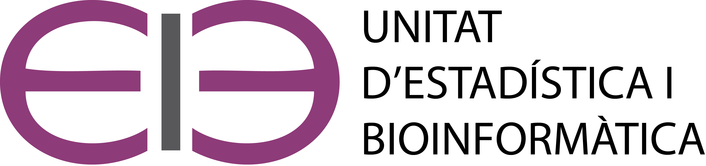

```{css, echo=FALSE}
h1 {
  color: #2C3E50; /* Títol principal */
}
h2 {
  color: #A569BD; /* Subtítol */
}
h3 {
  color: #ac39ac;
}
```


```{r setup, include=FALSE}
knitr::opts_chunk$set(echo = TRUE)
```


{ width=43% } { width=55% } 

# Informació del curs

<!-- ## Objectius -->

<!-- La recerca biomèdica té una component quantitativa important i els investigadors necessiten sovint poder processar i analitzar les dades que recullen o generen en els seus estudis. Si bé algunes d'aquestes anàlisis poden ser complexes i requerir de personal especialitzat n'hi ha d'altres que, amb els coneixements i els recursos adequats, són relativament senzilles de dur a terme. L'objectiu principal d'aquests curs és proporcionar una perspectiva general dels principals mètodes estadístics que poden resultar d'utilitat en el dia a dia de la recerca biomèdica o la pràctica clínica. El seu enfocament és aplicat i el que es persegueix és dotar els investigadors i professionals de la biomedicina, de conceptes i eines per saber quan cal aplicar cada tècnica, i com fer-ho utilitzant l'eina estadística apropiada.  -->

## Metodologia

Els professors presentaran les idees bàsiques fent servir materials en línia i exemples senzills i es proposaran exercicis d'anàlisis de dades per treballar i consolidar els conceptes. m, L'eina principal serà el llenguatge estadístic R amb la interfície Rstudio. Ambdues eines es poden descarregar lliurement de la web i s'instal·len fàcilment en ordinadors personals.

## Professorat

El curs està organitzat conjuntament per la Unitat d'Estadística i Bioinformàtica (UEB) del Vall d'Hebron Institut de Recerca (VHIR). El curs serà impartit pel Dr. Santiago Pèrez-Hoyos, Llicenciat en Matemàtiques , Esp. Estadística i Dr. en Salut Comunitària, i Cap de la Unitat d'Estadística i Bioinformàtica (UEB) del VHIR i la Sra. Miriam Mota-Foix Graduada en Estadística especialitzada en salut i Màster en Estadística i Bioinformàtica.


## Continguts del curs


- [Sessió 1.](#s1) Introducció a R i RStudio i Tidyverse. (#s1)

- [Sessió 2.](#s2) Estadística descriptiva I: Resums numèrics, taules i gràfics. Reproduïbilitat amb R.

- [Sessió 3.](#s3) Estadística descriptiva II: Gràfics i taules bivariants. Visualització de dades amb ggplot2..

- [Sessió 4.](#s4) Més manegament de dades amb R. Automatització de tasques amb scripts..

- [Sessió 5.](#s5) Sessió presencial de pràctiques en R i resolució de dubtes

- [Sessió 6.](#s6) Introducció a la inferència estadística. Intervals de confiança.

- [Sessió 7.](#s7) Proves d'hipòtesis I: Conceptes bàsics

- [Sessió 8.](#s8) Proves d'hipòtesis II: Variables quantitatives.

- [Sessió 9.](#s9) Proves d'hipòtesis III: Variables qualitatives.

- [Sessió 10.](#s10) Exercici resum d’anàlisis de dades reals


## Dates i localització

El curs té una durada de 20 hores i consisteix en 10 sessions de dues hores que es faran en dilluns (dimarts) i dimecres de 13 a 15. Es tracta d’una formació semipresencial que tindrà lloc els següents dies:
 
•	20, 21, 22, 27 de maig (en línia) de 13h. a 15h.

•	29 de maig (presencial - Sala de Juntes) de 13h. a 15h.

•	3, 4 i 5, 10 de juny (en línia) de 13h. a 15h.

•	12 de juny (presencial - Sala de Juntes) de 13h. a 15h.


## Materials del curs

### **Sessió 0 : Presentació del curs** {#s0}
  
- [Presentació](https://github.com/uebvhir/Course2020_Statistical-Analysis-with-R/raw/master/Slides/StatisticsWithR-0-Presentation_cb2021.pdf)

### **Sessió 1. Introducció a R i RStudio i Tidyverse** {#s1}
  
- [Presentació](https://github.com/uebvhir/Course2020_Statistical-Analysis-with-R/raw/master/Slides/StatisticsWithR-1-Introduction_to_R_cb2021.pdf)

- Datasets
  
    - [Osteoporosis (csv)](https://raw.githubusercontent.com/uebvhir/uebvhir.github.io/master/datasets/osteoporosis.csv)

    - [Diabetes (Excel)](https://github.com/uebvhir/uebvhir.github.io/raw/master/datasets/diabetes.xls)

###  **Sessió 2. Estadística descriptiva I: Resums numèrics, taules i gràfics. Reproduïbilitat amb R** {#s2}

- [Presentació](https://github.com/uebvhir/Course2020_Statistical-Analysis-with-R/raw/master/Slides/StatisticsWithR-2-exploratoryDataAnalysis.pdf)
  
- [Notebook](https://github.com/uebvhir/Course2020_Statistical-Analysis-with-R/raw/master/Slides/StatisticsWithR-2-EDA_withR.Rmd)

- [Exercicis](https://github.com/uebvhir/Course2020_Statistical-Analysis-with-R/raw/master/Slides/StatisticsWithR-2-EDA-Exercises.Rmd)

- Datasets
  
    - [diabetes (csv)](https://github.com/uebvhir/uebvhir.github.io/raw/master/datasets/diabetes.csv)

    - [Diabetes (Excel)](https://github.com/uebvhir/uebvhir.github.io/raw/master/datasets/diabetes_mod.xls)


###  **Sessió 3. Estadística descriptiva II: Gràfics i taules bivariants. Visualització de dades amb ggplot2.** {#s3}

- [Presentació](https://github.com/uebvhir/Course2020_Statistical-Analysis-with-R/raw/master/Slides/StatisticsWithR-3-Exploratory_Analysis_II_And_Graphics.pdf)
  
- [Notebook](https://github.com/uebvhir/Course2020_Statistical-Analysis-with-R/raw/master/Slides/StatisticsWithR-3-EDA_withR.Rmd)

- [Exercicis](https://github.com/uebvhir/Course2020_Statistical-Analysis-with-R/raw/master/Slides/Session3_Exercise_2021_PSPV_descriptive.pdf)

- [ggplotAssist](https://github.com/uebvhir/Course2020_Statistical-Analysis-with-R/raw/master/Slides/ggassist.pdf)
    
###  **Sessió 4. Més manegament de dades amb R. Automatització de tasques amb scripts** {#s4}

- [Presentació](https://github.com/uebvhir/Course2020_Statistical-Analysis-with-R/raw/master/Slides/StatisticsWithR-4-DataManagment.pdf)
  
- [Notebook](https://raw.githubusercontent.com/uebvhir/Course2020_Statistical-Analysis-with-R/master/Slides/sessio4_notebook.Rmd)

- [Horrible_base](https://github.com/uebvhir/Course2020_Statistical-Analysis-with-R/blob/master/datasets/horrible_base.csv)


###  **Sessió 5: Sessió presencial de pràctiques en R i resolució de dubtes.**{#s5}

- [Exercici](https://github.com/uebvhir/Course2020_Statistical-Analysis-with-R/raw/master/Slides/Session_5-Exercises_uni_bi.pdf)

- [Exercici Rmd](https://raw.githubusercontent.com/uebvhir/Course2020_Statistical-Analysis-with-R/master/Slides/Session_5-Exercises_uni_bi.Rmd)

- Datasets

    - [Demora (Excel)](https://github.com/uebvhir/uebvhir.github.io/raw/master/datasets/demora.xls)

    - [Demora (Stata)](https://github.com/uebvhir/Course2020_Statistical-Analysis-with-R/raw/master/datasets/demora.dta)

    - [Demora (csv)](https://raw.githubusercontent.com/uebvhir/Course2020_Statistical-Analysis-with-R/master/datasets/demora.csv)

- [Solució exercicis](https://raw.githubusercontent.com/uebvhir/Course2020_Statistical-Analysis-with-R/master/Slides/Session_5-Exercises_uni_bi_solucion.html)

###  **Sessió 6. Introducció a la inferència estadística. Intervals de confiança** {#s6}

- [Presentació](https://github.com/uebvhir/Course2020_Statistical-Analysis-with-R/raw/master/Slides/StatisticsWithR-5-Introduction_to_Statistical_Inference.pdf)
  
- [Notebook](https://github.com/uebvhir/Course2020_Statistical-Analysis-with-R/raw/master/Slides/Session_5-Exercises.Rmd)

- [Exercicis](https://github.com/uebvhir/Course2020_Statistical-Analysis-with-R/raw/master/Slides/Session_5-Exercises.pdf)

    
###  **Sessió 7. Proves d'hipòtesis I: Conceptes bàsics. Proves d'hipòtesis I** {#s7}

- [Presentació](https://github.com/uebvhir/Course2020_Statistical-Analysis-with-R/raw/master/Slides/StatisticsWithR-6-Principles_of_Hypothesis_Testing.pdf)
  
- [Notebook](https://github.com/uebvhir/Course2020_Statistical-Analysis-with-R/raw/master/Slides/StatisticsWithR-6-Principles_of_Hypothesis_Testing.nb.Rmd)

- [Questions](https://github.com/uebvhir/Course2020_Statistical-Analysis-with-R/raw/master/Slides/Session_6-Exercises.Rmd)

    
###  **Sessió 8. Proves d'hipòtesis II: Variables quantitatives** {#s8}

- [Presentació](https://github.com/uebvhir/Course2020_Statistical-Analysis-with-R/raw/master/Slides/StatisticsWithR-7-Tests_with_continuous_variables.pdf)
  
- [Notebook](https://github.com/uebvhir/Course2020_Statistical-Analysis-with-R/raw/master/Slides/StatisticsWithR-7-Tests_with_continuous_variables_notebook.Rmd)

- [Exercicis](https://github.com/uebvhir/Course2020_Statistical-Analysis-with-R/raw/master/Slides/Session_7_Exercises.pdf)

- Datasets
  
    - [data (Rda)](https://github.com/uebvhir/uebvhir.github.io/raw/master/datasets/data.Rda)
    
    
###  **Sessió 9. Proves d'hipòtesis III: Variables categòriques** {#s9}

- [Presentació](https://github.com/uebvhir/Course2020_Statistical-Analysis-with-R/raw/master/Slides/StatisticsWithR-8-Testing-with-categorical-variables.pdf)
  
- [Notebook](https://raw.githubusercontent.com/uebvhir/Course2020_Statistical-Analysis-with-R/master/Slides/StatisticsWithR-8-Testing%20with%20categorical%20variables.Rmd)

- Datasets
  
    - [Dades sobre relacio entre tabaquisme i cancer (csv)](https://github.com/uebvhir/Course2020_Statistical-Analysis-with-R/raw/master/Slides/datasets/dadescancer.csv)

    
<!-- ###  **Sessió 9. Test diagnòstics: Sensibilitat, especificitat i corbes ROC** {#s9} -->

<!-- - [Presentació](https://github.com/uebvhir/Course2020_Statistical-Analysis-with-R/raw/master/Slides/Statsistics_withR_9_Tests_diagnostics_PSPV.pdf) -->
  

### **Sessió 10. Exercici resum d’anàlisis de dades reals** {#s10}
- [Exercici Final](https://github.com/uebvhir/Course2020_Statistical-Analysis-with-R/raw/master/Slides/EBB2022_Exercici.pdf)

- Datasets

    - [Demora (Excel)](https://github.com/uebvhir/uebvhir.github.io/raw/master/datasets/demora.xls)

    - [Demora (Stata)](https://github.com/uebvhir/Course2020_Statistical-Analysis-with-R/raw/master/datasets/demora.dta)

    - [Demora (csv)](https://raw.githubusercontent.com/uebvhir/Course2020_Statistical-Analysis-with-R/master/datasets/demora.csv)

- [Solució exercicis](https://github.com/uebvhir/Course2020_Statistical-Analysis-with-R/raw/master/Slides/EBB2022_Exercici_Solucio.pdf)

### [Datasets](https://github.com/uebvhir/Course2020_Statistical-Analysis-with-R/tree/master/datasets)


---

<!-- ## Enquesta de satisfacció del curs -->

<!-- [Enquesta de satisfacció del curs Bioestadística 2025](https://servirredcap.vhir.org/redcap/surveys/?s=NCD4M3YACE) -->

## Enllaços i referències interessants

### R and Rstudio

[R Crash course: Introduction to R](https://github.com/uebvhir/Course2020_Statistical-Analysis-with-R/raw/master/Slides/R_Crash_Course.pdf)
[The Rproject for Statistical Computing](https://cran.r-project.org/)
[Pàgina web de descarga de R Studio](https://www.rstudio.com/products/rstudio/download/)

### Llibres i webs
[The Epidemiologist R Handbook](https://epirhandbook.com/index.html)
[R for Data Science](https://r4ds.had.co.nz/)
[Statistical Inference via Data Science](https://moderndive.com/)
[Frank Harrell's Biostatistics for Biomedical Research Web Site](https://hbiostat.org/bbr/)

### Tutorials
[R tutorial. Elementary Statisticcs with R]()
[Datasets](http://www.r-tutor.com/elementary-statistics)
[All Datasets](https://github.com/uebvhir/Course2020_Statistical-Analysis-with-R/tree/master/datasets)


_Última actualització: `r Sys.Date()`_

