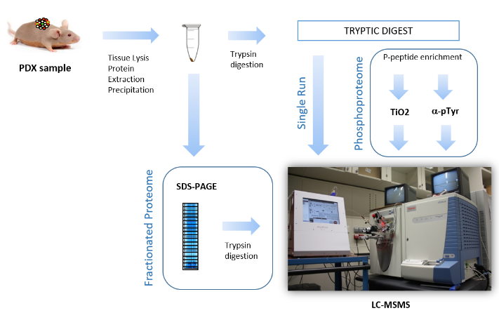

```{r global_options, include=FALSE}
knitr::opts_chunk$set(fig.width=10, fig.height=6, cache=FALSE, 
                      echo=TRUE, warning=FALSE, message=FALSE, results ='markup')
options(warn=-1, width=100)
```

```{r installation, echo=FALSE}
installifnot <- function (packageName){
 if (!(require(packageName, character.only=TRUE))) {
    install.packages(packageName)
  }else{
    detach(paste ("package", packageName, sep=":"), character.only=TRUE)
  } 
}
installifnot("knitr")
installifnot("readxl")
installifnot("writexl")
installifnot("tidyverse")
```

# Introduction

## Disclaimer

**_This is a toy example based on a dataset and some questions posed by one course attendant. WHile the process is similar to what one would do in a real case it has been simplified to make it easier to follow, so that the final results of the analysis should not be taken as definitive_**

## The problem

A phosphoproteomics experiment has been performed as described in figure 1.



- The experiment has analyzed (3 + 3) PDX models of two different subtypes using Phosphopeptide enriched samples. 
- LC-MS analysis of 2 technical duplicates
- The results set consisted of *Normalized abundances of MS signals for  ca. 1400 phosphopeptides*
- Goal of the analysis: **search phosphopeptides that allow differentiation of the two tumor groups*
- This should be made with both Statistical Analysis and visualization.
- Data have been provided as an excel file: `TIO2+PTYR-human-MSS+MSIvsPD.XLSX`
- Groups are defined as:
    + MSS group: Samples M1, M5 and T49, 
    + PD group: Samples M42, M43 and M64
with two technical replicates for each sample
- The first column, “SequenceModification” contains abundance values for the distinct phosphopetides. Other columns can be omitted.

# Data exploration

## Reading data

Start reading data. Remember spreadsheets from the same workbook can be read separately.

```{r}
require(readxl)
phData <- read_excel(path= "TIO2+PTYR-human-MSS+MSIvsPD.XLSX", sheet=1)
head(phData)
targets <- read_excel(path= "TIO2+PTYR-human-MSS+MSIvsPD.XLSX", sheet=2)
show(targets)
```

## Data visualization

A first look at file shows there are both numerical and character data. 
For ease of use we separate numerical values into a data matrix.

```{r}
library(tidyverse)
abundances <- phData %>% select (5:16) 
head(abundances)
```

Usually it is convenient that rows can be identified by short-but-meaningful names.
One may want to use column "accession" for this goal, but it happens not be usable because there are duplicates in this column and *rownames cannot have duplicates in R*.

This can be solved by cretaing new names with the `make.names` function.

```{r}
newRownames <- make.names(phData$Accession, unique=TRUE)
abundances <- as.data.frame(abundances)
rownames(abundances) <- newRownames
head(abundances)
```

## Plotting data

It is clear that abundance vary in a wide numeric range:

```{r}
summary(abundances)
```

```{r}
library(ggplot2)
ggplot(abundances)+geom_histogram(aes(x=M1_1_MSS),bins=20)
```

This is better seen with a multiple boxplot, that is one boxplot per column. 

### Boxplots in "base R"

Multiple boxplots are straightforward in base R. We only need to provide data as a `data.frame

```{r}
boxplot(abundances)
```

The plot suggests that it may be useful to transform the data taking logarithms. A quick-and-dirty approach is to take logarithms of the data to which we have added 1 to avoid problems with zeroes.

```{r}
boxplot(log10(abundances+1), las=2, main="Phosphoproteomics Experiment. Abundance in log 10 scale")
```

### Boxplots in `ggplot2`

In ggplot2 a boxplot is seen as a plot that relates one continuous and one categorical variable, so that data has to be reshaped into this type of structure (at least one numerical variable and one or more categorical variables) before the plot can be drawn. 

This can easily be done with `dplyr`'s `gather` function.

```{r}
logDat <- abundances %>% 
  gather() %>%
  mutate (logvalues= log (value+1)) %>%
  select (logvalues, key)
head(logDat)
```

Once we have the data in the required structure we can plot it.

```{r}
library(ggplot2)
ggplot(logDat) + 
  geom_boxplot(aes(x = key, y = logvalues))+
  theme(axis.text.x = element_text(angle = 90, hjust = 1))+
  ggtitle("Phosphoproteomics Abundances (log 10 scale)")
```

Notice that the boxplots are drawn *based on the alphabetic ordering of the categorical variable* and this may not be how we expected to see them!

This can be changed in different ways. Either using a characteristic of the groups to define the order (e.g. order by group median) or simply creating a new factor variable where the desired ordering is imposed.

```{r}
originalKey <- factor(logDat$key, levels=colnames(abundances))
ggplot(logDat) + 
  geom_boxplot(aes(x = originalKey, y = logvalues))+
  theme(axis.text.x = element_text(angle = 90, hjust = 1))+
  ggtitle("Phosphoproteomics Abundances (log 10 scale)")
```

### Creating covariates from the labels

In order to use the information on groups ("covariates") we must extract it from the column names.
(**Notice that they have been prepared specifically to contain this information!!!**)

```{r}
library(stringr)
covs <- str_split(logDat$key, "_", simplify=TRUE)
colnames(covs)<- c("Sample", "Replicate", "Group")
logDat2 <- cbind(logDat,covs)
```

This can be used for showing the groups in the plots

```{r}
ggplot(logDat2) + 
  geom_boxplot(aes(x = originalKey, y = logvalues, fill=Group, colour=Replicate))+
  theme(axis.text.x = element_text(angle = 90, hjust = 1))+
  ggtitle("Phosphoproteomics Abundances (log 10 scale)")
```

## Multivariate visualization: Principal components analysis

A nice way to plot a dataset is to do a Principal Components Analysis and then plot the first components.

For simplicity we use a function that has already been prepared and encapsulated do draw a scatterplot from the results of a PCA. It is available from github.

```{r}
source("https://raw.githubusercontent.com/uebvhir/UEB_PCA/master/UEB_plotPCA3.R")
plotPCA3(datos=as.matrix(log10(abundances+1)), labels=colnames(abundances), 
         factor=targets$Phenotype,title ="Phosphoproteomic data",
         scale=FALSE, colores=1:2, size = 3.5, glineas = 2.5)
```

The plot suggests that MSS and PD groups are differnt but the PD group seems more heterogeneous than the MSS one.


# Statistical Analysis

The analysis to select differentially abundant proteins will be based on a package called `limma` used mainly in microarrays. This package is part of Bioconductor (http://bioconductor.org) a giantic project created to develop open source software for omics data analysis based on R.

Packages from Bioconductor need to be installed with a specific function.

```{r}
if (!(require(limma))){
  source("http://bioconductor.org/biocLite.R")
  biocLite("limma")
}
```

Limma provides a sophisticated approach to omics data analysis based on the theory of the linear model. For simplicity we only describe the main ideas of the approach. Much more information is available in the user's guide.

The limma approach consists of creating 

1. a "design matrix" that describes assignment of samples to groups.
2. a "contrast" matrix that describes the comparisons to be performed

These two matrices are used in a set of calls to provide a list of potentially differentially expressed features.

```{r}
library(limma)
targets <- as.data.frame(targets)
groups <- as.factor(targets$Phenotype)
designMat <- model.matrix(~ -1 + groups)
show(designMat)
```

Technical replicates can be handled using a function called `duplicatecorrelation`that computes the mean correlation between replicates. This correlation is used then in the model fitting process.
```{r}
if (!require(statmod)) install.packages("statmod")
dupcor <- duplicateCorrelation(abundances, designMat,block=targets$Individual)
dupcor$consensus.correlation
```

Finally a "contrasta matrix" is prepared to describe the comparisons

```{r}
require(limma)
contMat <- makeContrasts(mainEff=groupsPD-groupsMSS, levels=designMat)
show(contMat)
```

Once the design and the contrast matrix are built we proceed as follows:

```{r}
fit <- lmFit(abundances, designMat, block=targets$Individual,correlation=dupcor$consensus)
fit2 <- contrasts.fit(fit, contMat)
fit2 <- eBayes(fit2)
results<- topTableF(fit2, adjust="BH",  number=nrow(abundances))
head(results)
```

The results of the analysis is a table where features, here proteins, are ordered from most to least differentially expressed according the results of the comparison performed.


The results can be shown in a *volcano Plot* that plots the biological (fold change) vs statistical (-log (p-value)) effect.

```{r}
volcanoplot(fit2, highlight=10, names=rownames(abundances), cex=0.75,
            xlim=c(-1e+06,1e+06))
```

The dispersion of the points suggests that the data are too variable so it may be good to review normalization and try to apply some type of dat scaling that reduces variability while keeping interesting differences.


